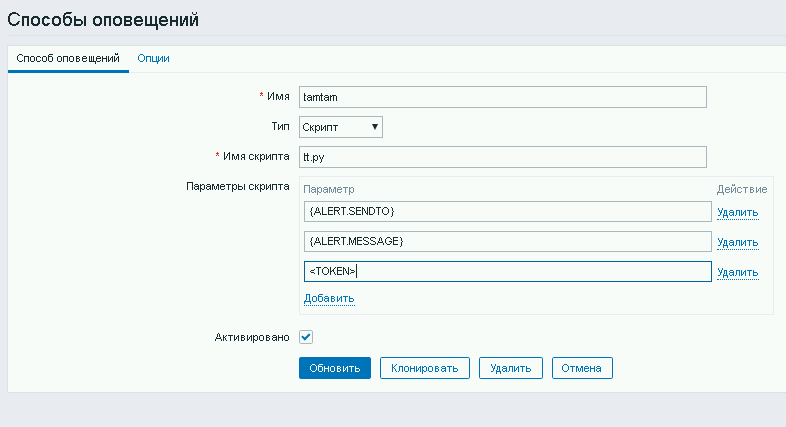

1. положить в alert_scripts  
2. сделать владельцем пользователя zabbix (chown zabbix:zabbix tt.py)  
3. сделать исполняемым (cmod u+x tt.py)  
4. в морде добавить способ оповещения 

5. ????  
6. понять и простить  
